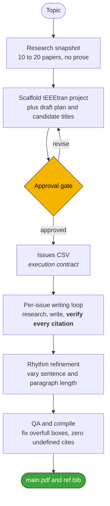

# arXiv Review Paper Harness

[](https://github.com/appautomaton/latex-arxiv-SKILL/stargazers)
[](https://www.anthropic.com/claude-code)
[](https://developers.openai.com/codex/skills)
[](agent-skills-standard.md)
[](#requirements)
[](LICENSE)

> **An agentic harness, packaged as a portable Agent Skill for Claude Code and Codex. It turns a topic into an arXiv-ready ML/AI review paper that is gated, issue-driven, and verified citation by citation.**

**arXiv Review Paper Harness** is an agentic harness for writing machine-learning and AI **review papers** in LaTeX. You give your coding agent a topic, and the harness drives it through a disciplined pipeline: literature discovery, a human approval gate, an issue-by-issue writing loop, citation verification, prose refinement, and compilation. The result is a two-column **IEEEtran** project that compiles to a PDF. Its skills and scripts follow the portable [Agent Skills standard](agent-skills-standard.md), so the same files run in **OpenAI Codex** and **Anthropic Claude Code**.

---

## How it works



The agent cannot write a single paragraph into `main.tex` until two conditions hold. First, you approve the plan. Second, the issues CSV exists. From there, every section is a tracked issue with target citations and acceptance criteria, and every citation is checked against a live source before it enters `ref.bib`.

## Why it's different

- **Hard quality gates, not vibes:** no prose before plan approval, and nothing marked `DONE` until acceptance criteria are met.
- **Verified citations only:** every `\cite{}` is web-checked against its source before being added, so there are no hallucinated references.
- **Issue-driven execution:** an `issues/*.csv` file is the single source of truth for progress, and the agent splits or inserts issues as scope grows instead of doing untracked work.
- **Deterministic where it matters:** scaffolding, plan and issue generation, arXiv discovery (with a local **SQLite cache**), validation, and compilation are Python scripts, so they behave the same on every run.
- **Dual-runtime:** one skill bundle that runs in both Claude Code and Codex.
- **Compiles or it is not done:** delivery requires a clean `pdflatex` and `bibtex` build with no undefined-citation warnings.

## Quickstart

The [`example/v0-single-SKILL`](example/v0-single-SKILL/) paper was generated by activating the `arxiv-paper-writer` skill with **two prompts**.

**Prompt 1 (start the paper):**

```text
write a review article for arxiv that is about SOTA generative image models
```

The agent does an initial literature pass, drafts a section framework, proposes candidate titles, and writes a `plan/<timestamp>-<slug>.md` with clarification questions.

> [!TIP]
> Open the generated `plan/` file and answer the clarification questions to steer scope, title, and coverage.

**Prompt 2 (delegate the decisions and proceed):**

```text
I will let you choose the best title and the topics and inclusion of material that you see the best fit
```

This second prompt is intentionally vague, and the plan questions were ignored. The harness still makes best-effort choices and produces a complete, compiling LaTeX project. See [`main.tex`](example/v0-single-SKILL/main.tex), [`ref.bib`](example/v0-single-SKILL/ref.bib), and [`main.pdf`](example/v0-single-SKILL/main.pdf).

## What's in the box

| Component | What it is |
|-----------|-----------|
| [`arxiv-paper-writer`](.codex/skills/arxiv-paper-writer/SKILL.md) | **The primary harness.** The gated workflow, guardrails, and success criteria. |
| `scripts/` | Deterministic Python helpers: scaffolding, plan and issue generation, CSV validation, LaTeX compile, and `arxiv_registry.py` (arXiv Atom-API discovery and BibTeX with a local SQLite cache). |
| [`latex-rhythm-refiner`](.codex/skills/latex-rhythm-refiner/SKILL.md) | Post-processes prose for readable sentence and paragraph rhythm while preserving every citation. |
| [`collaborating-with-claude`](.codex/skills/collaborating-with-claude/SKILL.md) · [`-gemini`](.codex/skills/collaborating-with-gemini/SKILL.md) | Bridges to delegate sub-tasks or get a second opinion from another model. |
| [`agent-skills-standard.md`](agent-skills-standard.md) | The repo's spec for authoring portable `SKILL.md` bundles across Codex and Claude Code. |
| [`example/`](example/) | Two fully generated papers, with plans, issue CSVs, sources, and compiled PDFs. |

## Examples

| Paper | Citations | Notes |
|-------|-----------|-------|
| [v0: Generative image models review](example/v0-single-SKILL/) | 55 verified | Single-skill run, the 2-prompt quickstart above. |
| [v0.5: Video world simulators (3D/4D) review](example/v0.5-sqlite-multi-SKILLs/video-world-simulators-3d4d-review/) | 81 verified | Multi-skill run with the SQLite arXiv registry and BibTeX cache. |

## Requirements

> [!IMPORTANT]
> A working LaTeX environment is required: `pdflatex` and `bibtex`, or `latexmk`.

- **Agent runtime:** OpenAI Codex or Anthropic Claude Code, with skills enabled.
- **Python 3.8+** for the helper scripts.
- **Web search and browsing** for citation verification.
- Tested on macOS with GPT-5.2 (Extra High).

## FAQ

**How does it prevent hallucinated or invented citations?**
Guardrails, built into the workflow. Every citation is verified against a live source before it enters `ref.bib`, and any claim without evidence becomes a TODO rather than a fabricated reference.

**Can I use it on an existing LaTeX project?**
Yes. Point it at your project and a citation-validation pass audits and repairs `ref.bib` without re-scaffolding anything.

**Can it write original or experimental research papers, not just reviews?**
Yes, with a little tailoring. Review and survey articles are its sweet spot out of the box, but nothing locks it there. Shape the plan and inputs to your goal, and the same gated workflow extends to original or experimental work.

## Credits

The issue-driven workflow is inspired by "issue-driven development" as demonstrated by [`appautomaton/agent-designer`](https://github.com/appautomaton/agent-designer).

## License

[MIT](LICENSE).
